<!-- README.md is generated from README.Rmd. Please only edit this (.Rmd) file! -->

<!-- Devel badges start: -->
[](https://CRAN.R-project.org/package=riskyr) 
[](https://www.r-pkg.org:443/pkg/riskyr) 
[](https://github.com/hneth/riskyr/actions/workflows/R-CMD-check.yaml)
<!-- Devel badges end. -->

<!-- Release badges start: -->
<!-- [](https://CRAN.R-project.org/package=riskyr)  -->
<!-- [](https://www.r-pkg.org/pkg/riskyr) -->
<!-- Release badges end. -->

<!-- Possible status badges: 
[](https://CRAN.R-project.org/package=riskyr) 
[](https://github.com/hneth/riskyr/actions/workflows/R-CMD-check.yaml)
[](https://travis-ci.org/hneth/riskyr/) 
[](https://www.r-pkg.org:443/pkg/riskyr) 
[](https://www.r-pkg.org/pkg/riskyr)
[](https://www.rdocumentation.org/packages/riskyr/) 
-->

```{r setup, echo = FALSE}
# Chunk options:
knitr::opts_chunk$set(
  collapse = TRUE,
  comment = "#>",
  fig.path = "inst/pix/README-",
  fig.align = "center"
)

# URLs:
url_riskyr_org <- "https://riskyr.org/"
```

<!-- riskyr logo: -->

# riskyr `r packageVersion('riskyr')` 

<!-- riskyr logo: -->  
<!-- 
<a href = "https://github.com/hneth/riskyr/">

</a> 
-->
<!--  -->
<!--  --> 
<!-- knitr::include_graphics("./inst/pix/riskyr_cube_s.png") -->


### A toolbox for rendering risk literacy more transparent {-}

<!-- Current package Description (updated on 2021-03-19): -->

Risk-related information ---\ like the prevalence of conditions, the sensitivity and specificity of diagnostic tests, or the effectiveness of interventions or treatments\ --- can be expressed in terms of frequencies or probabilities. By providing a toolbox of corresponding metrics and representations, **riskyr** computes, translates, and visualizes risk-related information in a variety of ways. Adopting multiple complementary perspectives provides insights into the interplay between key parameters and renders teaching and training programs on risk literacy more transparent.


## Motivation 

> Solving a problem simply means representing it <br>
> so as to make the solution transparent. (H.A. Simon)[^1]

[^1]: Simon, H.A. (1996). _The Sciences of the Artificial_ (3rd ed.). The MIT Press, Cambridge, MA. (p. 132).

<!-- Risk perception as representational effects: -->

The goals of **riskyr** are less of a _computational_ and more of a _representational_ nature: 
We express risk-related information in multiple formats, facilitate the translation between them, and provide a variety of attractive visualizations that emphasize different aspects of risk-related scenarios. Whereas people find it difficult to understand and compute information expressed in terms of probabilities, the same information is easier to understand and compute when expressed in terms of frequencies (e.g., Gigerenzer, 2002, 2014; Gigerenzer & Hoffrage, 1995). But rather than just expressing probabilities in terms of frequencies, **riskyr** allows translating between formats and illustrates the relationships between different representations in a variety of ways. Switching between and interacting with different representations fosters transparency and boosts human understanding of risk-related information.[^2]

<!-- Defining "risk" (in footnote): -->

[^2]: To clarify our notion of "risk" in this context, we need to distinguish it from its everyday usage as anything implying a chance of danger or harm.  
In basic research on judgment and decision making and the more applied fields of risk perception and risk communication, the term _risk_ typically refers to decisions or events for which the options and their consequences are known and probabilities for all possible outcomes can be provided.  
For our present purposes, the notion of risk-related information refers to any scenario in which some events of interest are determined by probabilities. While it is important that quantitative (estimates of) probabilities are provided, their origin, reliability and validity is not questioned here. Thus, the probabilities provided can be based on clinical intuition, on recordings of extensive experience, or on statistical simulation models (e.g., repeatedly casting dice and counting the frequencies of outcomes).  
This notion of _risk_ is typically contrasted with the much wider notion of _uncertainty_ in which options or probabilities are unknown or cannot be quantified. (See Gigerenzer and Gaissmaier, 2011, or Neth and Gigerenzer, 2015, on this conceptual distinction and corresponding decision strategies.) 

<!-- On "riskyr": -->

The basic assumptions and aspirations driving the current development of **riskyr** include:

1. Effective training in risk literacy requires transparent representations, smart strategies, and simple tools. 

2. We aim to provide a set of (computational and representational) functions that facilitate various calculations, translations between formats, and enable a range of alternative views on the interplay between probabilities and frequencies. 

3. Just as no single tool fits all tasks, no single graph illustrates all aspects of a problem. A variety of visualizations that illustrate the interplay of parameters and metrics can facilitate active and explorative learning. It is particularly helpful to view relationships from alternative perspectives and to observe the change of one parameter as a function of others. 

Based on these assumptions and goals, **riskyr** provides a range of computational and representational tools. Importantly, the objects and functions in the **riskyr** toolbox are not isolated, but complement, explain, and support each other. All functions and visualizations can be used separately or explored interactively, providing immediate feedback on the effect of changes in parameter values. By providing a variety of customization options, users can explore and design representations of risk-related information that fit to different tasks and meet their personal needs and goals.  


## Getting riskyr

### Installation

The current release of **riskyr** is available from [CRAN](https://CRAN.R-project.org/) at <https://CRAN.R-project.org/package=riskyr>:

```{r install-CRAN, echo = TRUE, eval = FALSE}
install.packages('riskyr')  # install riskyr from CRAN client
library('riskyr')           # load to use the package
```

The current development version can be installed from its [GitHub](https://github.com) repository at <https://github.com/hneth/riskyr/>: 

```{r install-github, echo = TRUE, eval = FALSE}
# install.packages('devtools')
devtools::install_github('hneth/riskyr')
```

### Available resources

- An **interactive online version** is available at [https://riskyr.org/](`r url_riskyr_org`). 

- The **package documentation** is available online:  
    - current release version: <https://hneth.github.io/riskyr/> 
    - current development version: <https://hneth.github.io/riskyr/dev/>

## Quick start guide 

<!-- 1: Defining a scenario -->

### Defining a scenario

**riskyr** is designed to address problems like the following:[^3]

[^3]: See Gigerenzer (2002, 2014), Gigerenzer and Hoffrage, U. (1995), Gigerenzer et al. (2007), and Hoffrage et al. (2015) for scientific background information and similar problems. See Sedlmeier and Gigerenzer (2001) and Kurzenhäuser and Hoffrage (2002) for related training programs (with remarkable results), and Micallef et al. (2012) and Khan et al. (2015) for (rather sceptical and somewhat sobering) studies on the potential benefits of static representations for solving Bayesian problems.

<!-- Example: -->

> **Screening for hustosis**  
>  
> A screening device for detecting the clinical condition of _hustosis_ is developed. The current device is very good, but not perfect. We have the following information:  
> 1. About 4% of the people of the general population suffer from _hustosis_.  
> 2. If someone suffers from hustosis, there is a chance of 80% that he or she will test positively for the condition.    
> 3. If someone is free from hustosis, there is a chance of 5% that he or she will still test positively for the condition.  
> 
> Mr. and Ms. Smith have both been screened with the device:  
> - Mr. Smith tested positively (i.e., received a diagnosis of hustosis).     
> - Ms. Smith tested negatively (i.e., was judged to be free of hustosis).   
> 
> Please answer the following questions:   
> - What is the probability that Mr. Smith actually suffers from hustosis?  
> - What is the probability that Ms. Smith is actually free of hustosis?  


#### Probabilities provided

The first challenge in solving such problems is in understanding the information that is being provided. 
The problem description provides three essential probabilities: 

1. The condition's _prevalence_ (in the general population) is 4%: `prev = .04`.  
2. The device's or diagnostic decision's _sensitivity_ is 80%: `sens = .80`.  
3. The device's or diagnostic decision's _false alarm rate_ is 5%: `fart = .05`, 
implying a _specificity_ of (100% $-$ 5%) = 95%: `spec = .95`.  

#### Understanding the questions asked

The second challenge here lies in understanding the questions that are being asked — and in realizing that their answers are _not_ simply the decision's sensitivity or specificity values. Instead, we are asked to provide two _conditional_ probabilities:

- The conditional probability of suffering from the condition given a positive test result, <br>aka. the _positive predictive value_ (`PPV`). 
- The conditional probability of being free of the condition given a negative test result, <br>aka. the _negative predictive value_ (`NPV`). 

#### Translating into frequencies

One of the best tricks in risk literacy education is to translate probabilistic information into frequencies.[^4] To do this, we imagine a representative sample of `N = 1000` individuals. Rather than asking about the probabilities for Mr. and Ms. Smith, we could re-frame the questions as:

> Assuming a representative sample of 1000 individuals:   
> - What proportion of individuals with a positive test result actually suffer from hustosis?  
> - What proportion of individuals with a negative test result are actually free of hustosis? 

[^4]: See Gigerenzer and Hoffrage (1995) and Hoffrage et al. (2000, 2002) on the concept of _natural frequencies_. 


#### Using riskyr

Here is how **riskyr** allows you to view and solve such problems:

```{r load-riskyr, eval = TRUE, message = FALSE, warning = FALSE}
library(riskyr)  # loads the package
```

#### Creating a scenario from probabilities

We define a new **riskyr** scenario (called `hustosis`) by using the `riskyr()` function and entering the information provided by our problem as its arguments: 

```{r ex1-definition, eval = TRUE}
hustosis <- riskyr(scen_lbl = "Example", 
                   cond_lbl = "Hustosis",
                   dec_lbl = "Screening",
                   popu_lbl = "Sample", 
                   N = 1000,  # population size
                   prev = .04, sens = .80, spec = (1 - .05)  # 3 probabilities
                   )
```

By providing the argument `N = 1000` we define the scenario for a target population of 1000 people. If we leave this parameter unspecified (or `NA`), the `riskyr()` function will automatically pick a suitable value of `N`. 

#### Summary

To obtain a quick overview of key parameter values, we ask for the `summary` of `hustosis`:

```{r ex1-summary, echo = TRUE, eval = FALSE}
summary(hustosis)  # summarizes key parameter values: 
```

The summary distinguishes between probabilities, frequencies, and accuracy information. In `Probabilities` we find the answer to both of our questions that take into account all the information provided above:

- The conditional probability that Mr. Smith actually suffers from hustosis given his positive test result is 40% (as `PPV = 0.400`). 

- The conditional probability that Ms. Smith is actually free of hustosis given her negative test result is 99.1% (as `NPV = 0.991`).

If find these answers surprising, you are an ideal candidate for additional insights into the realm of risk literacy. 
A key component of **riskyr** is to analyze and view a scenario from a variety of different perspectives. To get you started immediately, we only illustrate some introductory commands here and focus on different types of visualizations. (Call `riskyr.guide()` for various vignettes that provide more detailed information.) 

#### Creating a scenario from frequencies

Rather than defining our `hustosis` scenario by providing 3 essential probabilities (`prev`, `sens`, and `spec`), we could define the same scenario by providing 4 essential frequencies (`hi`, `mi`, `fa`, and `cr`) as follows:

```{r ex1-definition_freq, echo = TRUE, eval = TRUE}
hustosis_2 <- riskyr(scen_lbl = "Example", 
                     cond_lbl = "Hustosis",
                     dec_lbl = "Screening",
                     popu_lbl = "Sample", 
                     hi = 32, mi = 8, fa = 48, cr = 912  # 4 key frequencies
                     )
```

As we took the values of these frequencies from the `summary` of `hustosis`, the `hustosis_2` scenario should contain exactly the same information as `hustosis`:

```{r ex1-all-equal, eval = TRUE}
all.equal(hustosis, hustosis_2)  # do both contain the same information? 
```

### Visualizations

Various visualizations of **riskyr** scenarios can be created by a range of plotting functions. 

#### Prism plot

The default type of plot used in **riskyr** is a _prism plot_ (or network diagram) that shows key frequencies of a scenario as nodes and key probabilities as edges linking the nodes:

```{r ex1-prism, eval = FALSE, fig.width = 6, fig.height = 5, fig.show = 'hold'}
plot(hustosis)  # default plot

# => internally calls plot_prism(...) with many additional arguments:
# plot(hustosis, type = "prism", by = "cddc", area = "no", f_lbl = "num", p_lbl = "mix")
```

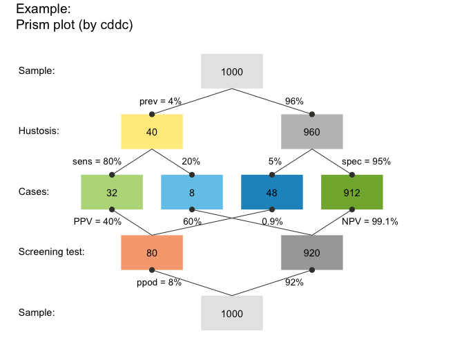

#### Tree diagram 

A _tree diagram_ is the upper half of a prism plot, which can be obtained by plotting a scenario with 1 of 3 perspectives:

1. by condition (`by = "cd"`), to split the population into _TRUE_ vs. _FALSE_ (`cond_true` vs. `cond_false`) cases; 
2. by decision (`by = "dc"`), to split the population into _negative_ vs. _positive_ (`dec_neg` vs. `dec_pos`) decisions; 
3. by accuracy (`by = "ac"`), to split the population into _correct_ vs. _incorrect_ (`dec_cor` vs. `dec_err`) decisions. 

For instance, the following command plots a frequency tree by decisions:

```{r ex1-tree, eval = FALSE, fig.width = 6, fig.height = 3.5}
plot(hustosis, by = "dc")  # plot a tree diagram (by decision)
```

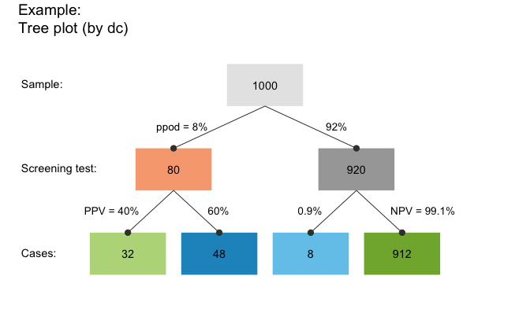

This particular tree splits the population of `N = 1000` individuals into two subgroups _by decision_ (`by = "dc"`) and contains the answer to the second (frequency) version of our questions:

- The proportion of individuals with a positive test result who actually suffer from hustosis is the frequency of "true positive" cases (shown in darker green) divided by "decision positive" cases (shown in purple): `32/80 = .400` (corresponding to our value of `PPV` above).  
- The proportion of individuals with a negative test result who are actually free from hustosis is the frequency of "true negative" cases (shown in lighter green) divided by "decision negative" cases (shown in blue): `912/920 = .991` (corresponding to our value of `NPV` above, except for minimal differences due to rounding). 

Of course, the frequencies of these ratios were already contained in the `hustosis` summary above. But the representation in the form of a tree diagram makes it easier to understand the decomposition of the population into subgroups and to see which frequencies are required to answer a particular question.

#### Frequency net

A new type of visualization combines elements from 2x2 tables with those of tree or double tree diagrams. 
The _frequency net_ (Binder et al., 2020) is similar to a 2x2 table insofar as its perspectives (shown by arranging marginal frequencies in a vertical vs. horizontal fashion) do not suggest an order or dependency (in contrast to trees or mosaic plots). 
Additionally, the frequency net allows showing 3\ kinds of (_marginal_, _conditional_, and _joint_) probabilities:

```{r ex1-fnet, eval = FALSE, fig.width = 6, fig.height = 5}
plot(hustosis, type = "fnet", by = "cddc",
     f_lbl = "namnum")  # plot frequency net
```

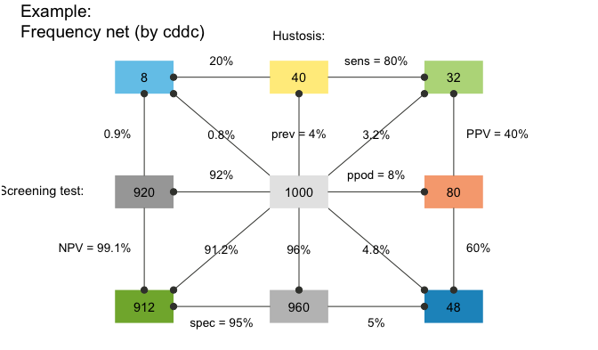

See the `plot_fnet()` function for options and details.

#### Icon array 

An icon array shows the classification result for each of `N = 1000` individuals in our population: 

```{r ex1-icons, eval = FALSE, fig.width = 5.5, fig.height = 3.5}
plot(hustosis, type = "icons")   # plot an icon array 
```


While this particular icon array is highly regular (as both the icons and classification types are ordered), **riskyr** provides many different versions of this type of graph. This allows viewing the probability of diagnostic outcomes as either frequency, area, or density (see `?plot_icons` for details and examples). 

#### Area plot

An area plot (or mosaic plot) offers a way of expressing classification results as the relationship between areas. Here, the entire population is represented as a square and the probability of its subgroups as the size of rectangles (see `?plot_area` for details and examples):  

```{r ex1-area, eval = FALSE, fig.width = 5.5, fig.height = 4.0}
plot(hustosis, type = "area")  # plot an area/mosaic plot (by = "cddc")
```

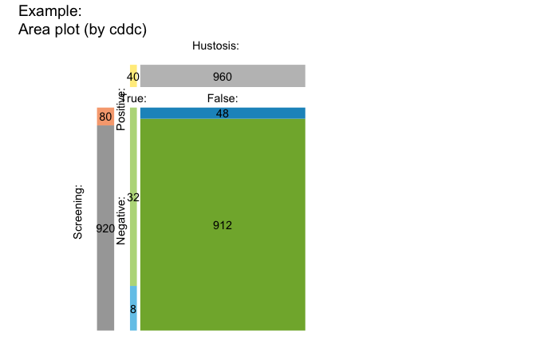

#### Table plot

When not scaling the size of rectangles by their relative frequencies or probabilities, we can plot basic scenario information as a 2-by-2 confusion (or contingency) table (see `?plot_tab` for details and examples):  

```{r ex1-tab, eval = FALSE, fig.width = 5.5, fig.height = 4}
plot(hustosis, type = "table")  # plot 2x2 confusion table (by = "cddc") 
```

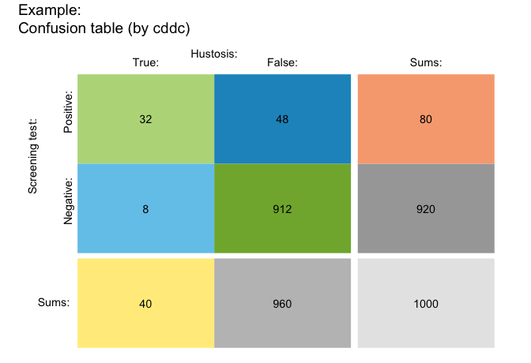

#### Bar plot

A _bar plot_ allows comparing relative frequencies as the heights of bars (see `?plot_bar` for details and examples):  

```{r ex1-bar, eval = FALSE, fig.width = 5.5, fig.height = 5.0}
plot(hustosis, type = "bar", f_lbl = "abb")  # plot bar chart (by "all" perspectives): 
```

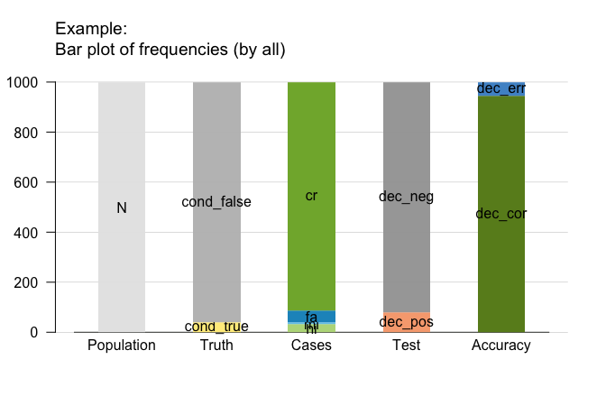

#### Curves

By adopting a functional perspective, we can ask how the values of some probabilities (e.g., the predictive values `PPV` and `NPV`) change as a function of another (e.g., the condition's prevalence `prev`, see `?plot_curve` for details and examples):

```{r ex1-curve, eval = FALSE, fig.width = 5.5, fig.height = 4.5}
plot(hustosis, type = "curve", uc = .05)   # plot probability curves (by prevalence):
```

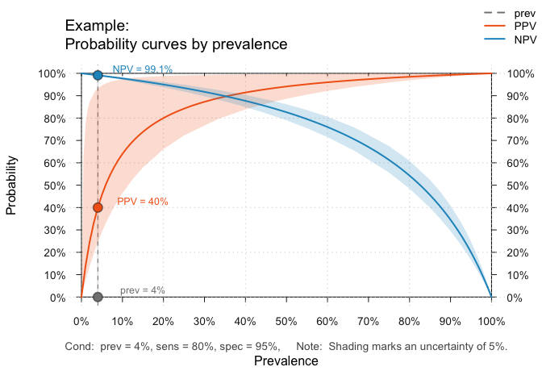

#### Planes 

When parameter values systematically depend on two other parameters, we can plot this as a plane in a 3D cube. The following graph plots the `PPV` as a function of the sensitivity (`sens`) and specificity (`spec`) of our test for a given prevalence (`prev`, see `?plot_plane` for details and examples):

```{r ex1-plane, eval = FALSE, fig.width = 5, fig.height = 4}
plot(hustosis, type = "plane")  # plot probability plane (by sens x spec):
```

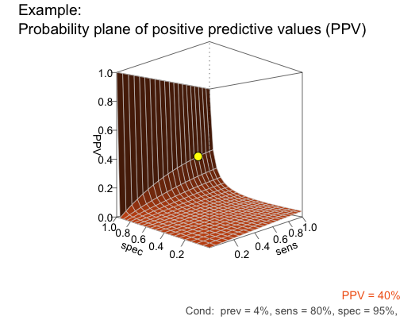

The L-shape of this plane reveals a real problem with our current test: Given a prevalence of 4% for hustosis in our target population, the `PPV` remains very low for the majority of the possible range of sensitivity and specificity values. To achieve a high `PPV`, the key requirement for our test is an extremely high specificity. Although our current specificity value of 95% (`spec = .95`) may sound pretty good, it is still not high enough to yield a `PPV` beyond 40%. 

<!--

#### Plots currently under development

The current development version of **riskyr** (version 0.1.0.930+) replaces some of the above plots with a set of more powerful and more integrated functions. To use them and preview their effects, install the development version and explore the following commands:

```{r preview-current-dev, echo = TRUE, eval = FALSE}
## Install current development version: 
# install.packages("devtools")
devtools::install_github("hneth/riskyr")

## Preview latest functions (riskyr > v0.0.1.930):
plot(hustosis, type = "prism", by = "cddc")  
plot(hustosis, type = "tree",  by = "ac") 
plot(hustosis, type = "area",  by = "cddc")
plot(hustosis, type = "tab",   by = "cddc")
plot(hustosis, type = "bar",   dir = 2)
```

-->

<!-- 2: Loading and using pre-defined scenarios -->

### Using existing scenarios

As defining your own scenarios can be cumbersome and the literature is full of risk-related problems (often referred to as "Bayesian reasoning"), **riskyr** provides a set of — currently `r length(scenarios) - 1` — pre-defined scenarios (stored in a list `scenarios`). 
Here, we provide an example that shows how you can select and explore them. 

#### Selecting a scenario

Let us assume you want to learn more about the controversy surrounding screening procedures of prostate-cancer (known as PSA screening). Scenario 10 in our collection of `scenarios` is from an article on this topic (Arkes & Gaissmaier, 2012). To select a particular scenario, simply assign it to an R object. For instance, we can assign Scenario 10 to `s10`:

```{r ex2-select, eval = TRUE}
s10 <- scenarios$n10  # assign pre-defined Scenario 10 to s10
```

#### Scenario summary 

Our selected scenario object `s10` is a list with `r length(s10)` elements, which describe it in both text and numeric variables. The following commands provide an overview of `s10` in text form:

```{r ex2-basic-info, eval = FALSE}
s10$scen_lbl   # a descriptive label
s10$cond_lbl   # the current condition
s10$dec_lbl    # the current decision
s10$popu_lbl   # the current population

# summary(s10) # summarizes a scenario
```

Generating some **riskyr** plots allows a quick visual exploration of the scenario. 
We only illustrate some selected plots and options here, and trust that you will play with and explore the rest for yourself.

#### Prism plots

A tree diagram is a prism plot that views the population from only one perspective, but provides a quick overview. In the following plot, the boxes are depicted as squares with area sizes that are scaled by relative frequencies (using the `area = "sq"` argument): 

```{r ex2-tree, eval = FALSE, fig.width = 5.5, fig.height = 3.5}
plot(s10, type = "tree", by = "cd", area = "sq",  # tree/prism plot with scaled squares 
     f_lbl = "def", f_lbl_sep = ":\n")            # custom frequency labels 
```

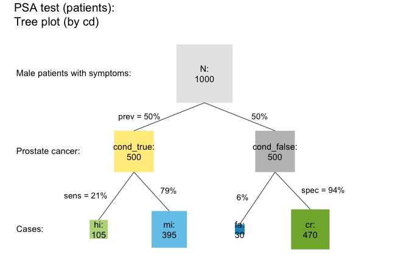

The prism plot (or network diagram) combines 2 tree diagrams to simultaneously provide two perspectives on a population (see Wassner et al., 2004). **riskyr** provides several variants of prism plots. To avoid redundancy to the previous tree diagram, the following version splits the population by accuracy and by decision (see the `by = "acdc"` argument). In addition, the frequencies are represented as horizontal rectangles (`area = "hr"`) so that their relative width reflect the number of people in the corresponding subgroup: 

```{r ex2-prism-hr, eval = FALSE, fig.width = 6, fig.height = 4}
plot(s10, type = "prism", by = "acdc", area = "hr",  # prism plot with horizontal rectangles
     p_lbl = "num")                                  # numeric probability labels
```

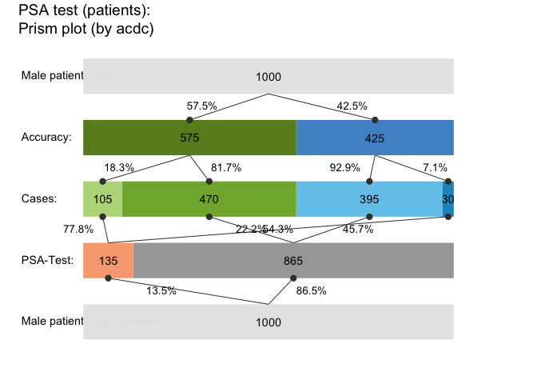

#### Frequency net

Just like the 2x2 table, area plot, and prism plot, the frequency net allows selecting two out of three perspectives. 
Additionally, the shape and size of the frequency boxes can be adjusted by using the `area = "sq"` option. 
The following example shows a frequency net by condition and accuracy (`by = "cdac"`) without the joint probabilities, 
with custom settings for labels, links, and colors: 

```{r ex2-fnet, eval = FALSE, fig.width = 5.5, fig.height = 3.5}
plot(s10, type = "fnet", by = "cdac",  # frequency net (by condition and accuracy) 
     area = "sq", joint_p = FALSE, arr_c = 2,     # custom areas, links, and arrows 
     f_lbl = "namnum", p_lbl = "num", col_pal = pal_rgb) # custom labels and colors 
```


#### Icon array

```{r ex2-icons, eval = FALSE, fig.width = 5.5, fig.height = 3.5}
plot(s10, type = "icons", arr_type = "shuffled")   # plot a shuffled icon array 
```

<!-- 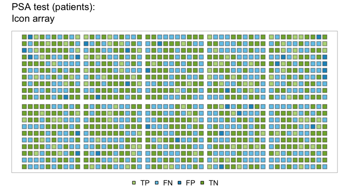 --> 

#### Area plot

```{r ex2-area, eval = FALSE, fig.width = 5.5, fig.height = 4.5}
plot(s10, type = "area", p_split = "v", p_lbl = "def")  # plot an area/mosaic plot (with probabilities) 
```

<!-- 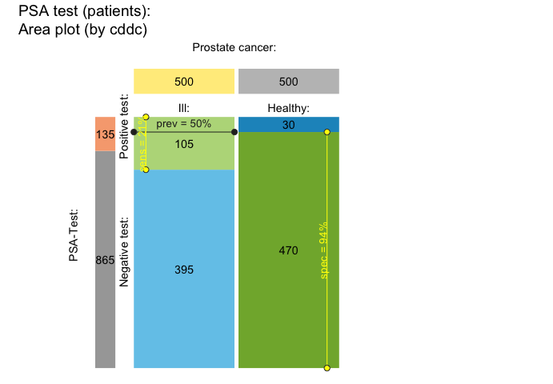 -->

#### Table plot

```{r ex2-tab, eval = FALSE, fig.width = 5.5, fig.height = 4.5}
plot(s10, type = "tab", p_split = "h", p_lbl = "def")  # plot a 2x2 table (with probabilities)
```

<!-- 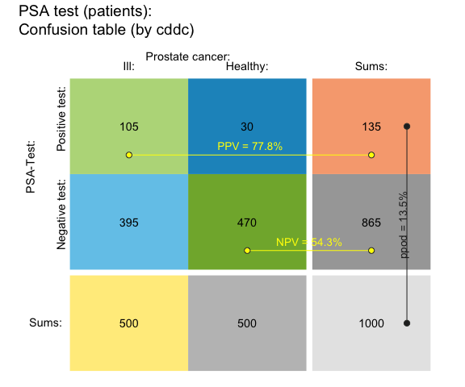 -->

#### Curves 

The following curves show the values of several conditional probabilities as a function of prevalence: 

```{r ex2-curve, eval = FALSE, fig.width = 5.5, fig.height = 4.5}
plot(s10, type = "curve", what = "all", uc = .05)  # plot all curves (by prev):
```

<!-- 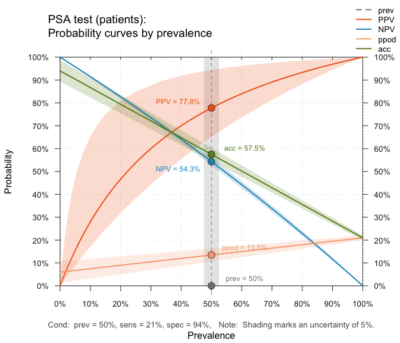 --> 

Adding the argument `what = "all"` also shows the proportion of positive decisions (`ppod`) and the decision's overall accuracy (`accu`) as a function of the prevalence (`prev`). Would you have predicted their shape without seeing this graph?

#### Planes

The following surface shows the negative predictive value (NPV) as a function of sensitivity and specificity (for a given prevalence): 

```{r ex2-plane, eval = FALSE, fig.width = 5.5, fig.height = 4}
plot(s10, type = "plane", what = "NPV")  # plot plane (as a function of sens x spec):
```

<!-- 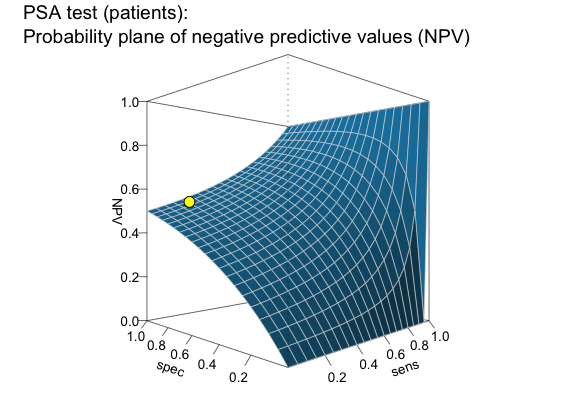 --> 

Hopefully, this brief overview managed to whet your appetite for visual exploration. 
If so, call `riskyr.guide()` for viewing the package vignettes and obtaining additional information. 


## About

<!-- uni.kn logo and link to SPDS: -->  
<!--  --> 
<a href="https://www.spds.uni-konstanz.de/">

<!--  --> 
</a>

**riskyr** originated out of a series of lectures and workshops on risk literacy.  
The current version (0.4.0, as of Aug. 15, 2022) is under active development. 
Its primary designers are 
[Hansjörg Neth](https://www.spds.uni-konstanz.de/hans-neth), 
[Felix Gaisbauer](https://www.spds.uni-konstanz.de/people), 
[Nico Gradwohl](https://www.spds.uni-konstanz.de/people), and 
[Wolfgang Gaissmaier](https://www.spds.uni-konstanz.de/people), who are researchers at the department of 
[Social Psychology and Decision Sciences](https://www.spds.uni-konstanz.de/) at the 
[University of Konstanz](https://www.uni-konstanz.de/en/), Germany. 

The **riskyr** package is open source software written in [R](https://www.r-project.org/) and released under the 
[GPL 2](https://tldrlegal.com/license/gnu-general-public-license-v2) | 
[GPL 3](https://tldrlegal.com/license/gnu-general-public-license-v3-(gpl-3)) licenses.  

The theoretical background of **riskyr** is illuminated further in the following article:

- Neth, H., Gradwohl, N., Streeb, D., Keim, D.A., & Gaissmaier, W. (2021). 
Perspectives on the 2x2 matrix: 
Solving semantically distinct problems based on a shared structure of binary contingencies. 
_Frontiers in Psychology: Cognition_, _11_, 567817. 
doi: [10.3389/fpsyg.2020.567817](https://doi.org/10.3389/fpsyg.2020.567817) 


### Resources

The following resources and versions are currently available:

Type:                    | Version:           | URL:                           |        
:------------------------|:-------------------|:-------------------------------|
A. **riskyr** (R package): | [Release version](https://CRAN.R-project.org/package=riskyr)  | <https://CRAN.R-project.org/package=riskyr> |
    &nbsp;               | [Development version](https://github.com/hneth/riskyr/)         | <https://github.com/hneth/riskyr/> | 
B. **riskyrApp** (R Shiny code): | [Online version](`r url_riskyr_org`)                    | [https://riskyr.org/](`r url_riskyr_org`) | 
    &nbsp;               | [Development version](https://github.com/hneth/riskyrApp/)      | <https://github.com/hneth/riskyrApp/> | 
C. Online documentation: | [Release version](https://hneth.github.io/riskyr/)              | <https://hneth.github.io/riskyr/> | 
    &nbsp;               | [Development version](https://hneth.github.io/riskyr/dev/)      | <https://hneth.github.io/riskyr/dev/> | 


### Contact

We appreciate your feedback, comments, or questions. 

- Please report any **riskyr**-related issues at <https://github.com/hneth/riskyr/issues/>. 

- Contact us at <contact.riskyr@gmail.com> with any comments, questions, or suggestions. 


### Reference

<!-- riskyr logo: -->  
<a href = "https://github.com/hneth/riskyr/">

</a> 
<!--  -->
<!--  --> 
<!-- knitr::include_graphics("./inst/pix/riskyr_cube_s.png") -->

To cite **riskyr** in derivations and publications, please use:

- Neth, H., Gaisbauer, F., Gradwohl, N., & Gaissmaier, W. (2022).  
  riskyr: Rendering Risk Literacy more Transparent.  
  Social Psychology and Decision Sciences, University of Konstanz, Germany.  
  Computer software (R package version 0.4.0, Aug. 15, 2022).  
  Retrieved from <https://CRAN.R-project.org/package=riskyr>.  

A BibTeX entry for LaTeX users is: 

    @Manual{riskyr,
      title = {riskyr: Rendering Risk Literacy more Transparent},
      author = {Hansjörg Neth and Felix Gaisbauer and Nico Gradwohl and Wolfgang Gaissmaier},
      year = {2022},
      organization = {Social Psychology and Decision Sciences, University of Konstanz},
      address = {Konstanz, Germany},
      note = {R package (version 0.4.0, Aug. 15, 2022)},
      url = {https://CRAN.R-project.org/package=riskyr},
      }    
    
Calling `citation("riskyr")` in the package also displays this information.

### References

- Arkes, H. R., & Gaissmaier, W. (2012). 
Psychological research and the prostate-cancer screening controversy. 
_Psychological Science_, _23_, 547–553.

- Binder, K., Krauss, S., and Wiesner, P. (2020). A new visualization for probabilistic situations containing
two binary events: The frequency net. _Frontiers in Psychology_, _11_, 750. 
doi: [10.3389/fpsyg.2020.00750](https://doi.org/10.3389/fpsyg.2020.00750)

- Garcia-Retamero, R., & Cokely, E. T. (2017). 
Designing visual aids that promote risk literacy: 
A systematic review of health research and evidence-based design heuristics. 
_Human Factors_, _59_, 582–627.  

- Gigerenzer, G. (2002). 
_Reckoning with risk: Learning to live with uncertainty_. 
London, UK: Penguin.

- Gigerenzer, G. (2014). 
_Risk savvy: How to make good decisions_. 
New York, NY: Penguin.

- Gigerenzer, G., & Gaissmaier, W. (2011). 
Heuristic decision making. 
_Annual Review of Psychology_, _62_, 451–482. 
([Available online](https://doi.org/10.1146/annurev-psych-120709-145346)) 

- Gigerenzer, G., Gaissmaier, W., Kurz-Milcke, E., Schwartz, L., & Woloshin, S. (2007). 
Helping doctors and patients make sense of health statistics. 
_Psychological Science in the Public Interest_, _8_, 53–96. 
([Available online](https://doi.org/10.1111/j.1539-6053.2008.00033.x))

- Gigerenzer, G., & Hoffrage, U. (1995). 
How to improve Bayesian reasoning without instruction: Frequency formats. 
_Psychological Review_, _102_, 684–704.

- Hoffrage, U., Gigerenzer, G., Krauss, S., & Martignon, L. (2002). 
Representation facilitates reasoning: What natural frequencies are and what they are not. 
_Cognition_, _84_, 343–352.

- Hoffrage, U., Krauss, S., Martignon, L., & Gigerenzer, G. (2015). 
Natural frequencies improve Bayesian reasoning in simple and complex inference tasks. 
_Frontiers in Psychology_, _6_, 1473. 
doi: [10.3389/fpsyg.2015.01473](https://doi.org/10.3389/fpsyg.2015.01473) 
([Available online](https://doi.org/10.3389/fpsyg.2015.01473)) 

- Hoffrage, U., Lindsey, S., Hertwig, R., & Gigerenzer, G. (2000). 
Communicating statistical information. 
_Science_, _290_, 2261–2262.

- Khan, A., Breslav, S., Glueck, M., & Hornbæk, K. (2015). 
Benefits of visualization in the mammography problem. 
_International Journal of Human-Computer Studies_, _83_, 94–113.  

- Kurzenhäuser, S., & Hoffrage, U. (2002). 
Teaching Bayesian reasoning: An evaluation of a classroom tutorial for medical students. 
_Medical Teacher_, _24_, 516–521.

- Kurz-Milcke, E., Gigerenzer, G., & Martignon, L. (2008). 
Transparency in risk communication. 
_Annals of the New York Academy of Sciences_, _1128_, 18–28.

- Micallef, L., Dragicevic, P., & Fekete, J.-D. (2012). 
Assessing the effect of visualizations on Bayesian reasoning through crowd-sourcing. 
_IEEE Transactions on Visualization and Computer Graphics_, _18_, 2536–2545.  

- Neth, H., & Gigerenzer, G. (2015). 
Heuristics: Tools for an uncertain world. 
In R. Scott & S. Kosslyn (Eds.), _Emerging trends in the social and behavioral sciences_. 
New York, NY: Wiley Online Library. 
doi: [10.1002/9781118900772.etrds0394](https://doi.org/10.1002/9781118900772.etrds0394) 
([Available online](https://citeseerx.ist.psu.edu/viewdoc/download?doi=10.1.1.726.1656&rep=rep1&type=pdf))  

- Neth, H., Gradwohl, N., Streeb, D., Keim, D.A., & Gaissmaier, W. (2021). 
Perspectives on the 2x2 matrix: Solving semantically distinct problems based on a shared structure of binary contingencies. 
_Frontiers in Psychology_, _11_, 567817. 
doi: [10.3389/fpsyg.2020.567817](https://doi.org/10.3389/fpsyg.2020.567817) 
([Available online](https://doi.org/10.3389/fpsyg.2020.567817))  

- Sedlmeier, P., & Gigerenzer, G. (2001). 
Teaching Bayesian reasoning in less than two hours. 
_Journal of Experimental Psychology: General_, _130_, 380–400.

- Wassner, C., Martignon, L., & Biehler, R. (2004). 
Bayesianisches Denken in der Schule. 
_Unterrichtswissenschaft_, _32_, 58–96.


<!-- footer: -->

------ 

[`README.Rmd` updated on `r format(Sys.time(), "%Y-%m-%d")` by [hn](https://neth.de).] 

<!-- eof --> 
