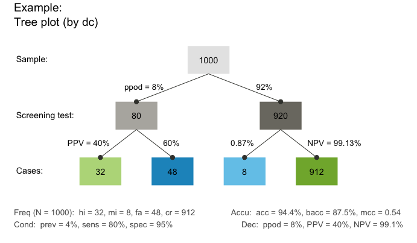
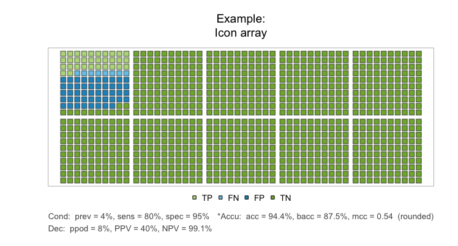
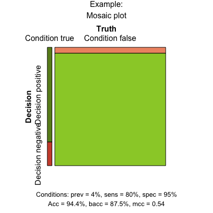
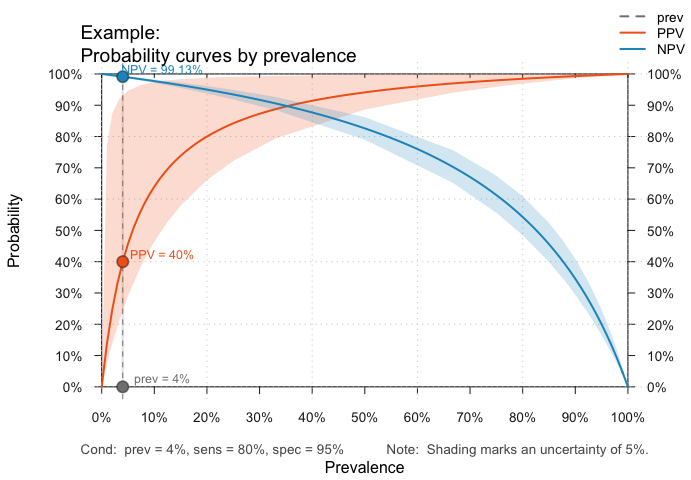
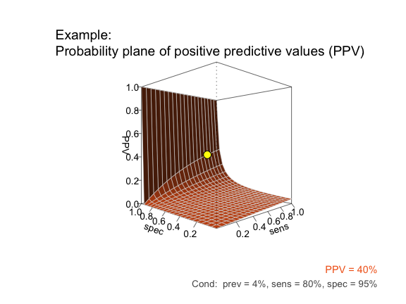
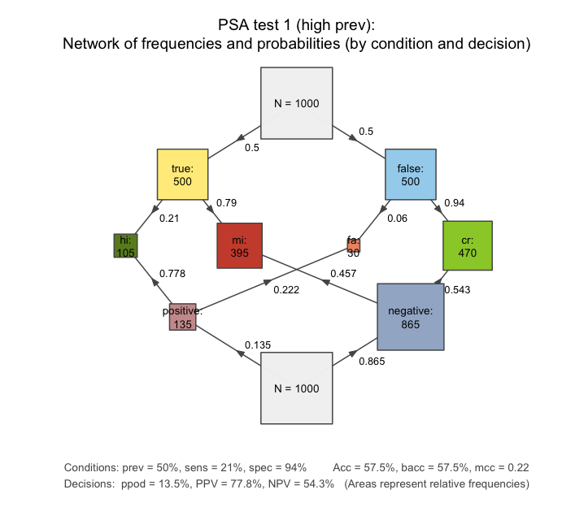

[](https://CRAN.R-project.org/package=riskyr) [](https://travis-ci.org/hneth/riskyr) <!-- [](http://www.r-pkg.org/pkg/riskyr) -->

<!-- README.md is generated from README.Rmd. Please only edit the latter (.Rmd) file! -->
riskyr
======

**A toolbox for rendering risk literacy more transparent**

Risk-related information — like the prevalence of conditions and the sensitivity and specificity of diagnostic tests — can be expressed in terms of probabilities or frequencies. By providing a toolbox of methods and metrics, `riskyr` computes, translates, and displays risk-related information in a variety of ways. Offering multiple complementary perspectives on the interplay between key parameters renders teaching and training of risk literacy more transparent.

Motivation
----------

> Solving a problem simply means representing it <br> so as to make the solution transparent. (H.A. Simon)[1]

<!-- Risks as representational effects: -->
The issues addressed by `riskyr` are less of a *computational* and more of a *representational* nature (i.e., concerning the expression in and translation between different formats of information). Whereas people tend to find it difficult to understand and compute information expressed in terms of *probabilities*, the same information is often easy to understand and compute when expressed in terms of *frequencies*. But rather than just expressing risk-related information in terms of frequencies, `riskyr` allows translating between formats and illustrates their relationships in a variety of transparent and interactive ways.

<!-- Defining the notion of "risk": -->
To clarify the concept of "risk" in this context: In research on probability judgments and risk perception, the term *risk* typically refers to decisions or events for which the options and their consequences are known and *probabilities* for all possible outcomes can be provided.[2] For our present purposes, the notion of risk-related information refers to any scenario in which some events of interest are determined by probabilities. While it is important that quantitative (estimates of) probabilities are provided, their origin, reliability and validity is not questioned here. Thus, the probabilities provided can be based on clinical intuition, on recordings of extensive experience, or on statistical simulation models (e.g., repeatedly casting dice and counting the frequencies of outcomes).

<!-- riskyr logo: -->
<a href = "https://github.com/hneth/riskyr"> <!--  -->  </a> <!--  --> <!-- knitr::include_graphics("./inst/pix/riskyr_cube.png") -->

<!-- On "riskyr": -->
Basic assumptions and goals driving the current development of `riskyr` include the following:

1.  Effective training in risk literacy requires simple tools and transparent representations.

2.  More specifically, it would be desirable to have a set of (computational and representational) tools that allow various calculations, translations (between formats), and a range of alternative views on the interplay between probabilities and frequencies.

3.  Seeing a variety of visualizations that illustrate how parameters and metrics interact and influence each other facilitates active and explorative learning. It is particularly helpful to view the same or similar relationships from alternative representations or to inspect the change of one parameter as a function of changes in other parameters.

To deliver on these assumptions and goals, we provide a range of computational and representational tools. Importantly, the objects and functions in the `riskyr` toolbox are not isolated, but complement, explain, and support each other. All functions and visualizations can also be used separately and explored interactively, providing immediate feedback on the effect of changes in parameter values. By providing a variety of customization options, users can explore and design representations of risk-related information that suit their personal goals and needs.

Installation
------------

The current release of `riskyr` is available from [CRAN](https://CRAN.R-project.org/) at <https://CRAN.R-project.org/package=riskyr>:

``` r
install.packages("riskyr")  # install riskyr from CRAN client
library("riskyr")           # load to use the package
```

The most recent development version can be installed from its [GitHub](https://github.com) repository at <https://github.com/hneth/riskyr/>:

``` r
# install.packages("devtools")
devtools::install_github("hneth/riskyr")
```

Quick Start Guide
-----------------

### Defining a scenario

`riskyr` is designed to address problems like the following:[3]

> **Screening for hustosis**
>
> A new screening device for detecting the clinical condition of *hustosis* is developed. The current device is very good, but not yet perfect. It has the following properties:
> 1. About 4% of the general population suffer from *hustosis*.
> 2. If someone suffers from hustosis, there is a chance of 80% that he or she will test positively for the condition.
> 3. If someone is free from hustosis, there is a chance of 4% that he or she will still test positively for the condition.
>
> Mr. and Ms. Smith have both been screened with this device:
> - Mr. Smith tested positively (i.e., received a diagnosis of hustosis).
> - Ms. Smith tested negatively (i.e., was judged to be free of hustosis).
>
> Please answer the following questions:
> - What is the probability that Mr. Smith actually suffers from hustosis?
> - What is the probability that Ms. Smith is actually free of hustosis?

#### Probabilities provided

The first challenge in solving such problems is in understanding the information provided. The problem description provides three essential probabilities:

1.  The condition's *prevalence* (in the general population) of 4%: `prev = .04`.
2.  The device's or diagnostic decision's *sensitivity* of 80%: `sens = .80`.
3.  The device's or diagnostic decision's *false alarm rate* of 4%, implying a *specificity* of (100% − 4%) = 96%: `spec = .04`.

#### Understanding the questions asked

The second challenge here lies in understanding the questions that are being asked -- and in realizing that their answers are *not* simply the decision's sensitivity or specificity values. Instead, we are asked to provide two *conditional* probabilities:

-   The conditional probability of suffering from the condition given a positive test result, <br>aka. the *positive predictive value* (`PPV`).
-   The conditional probability of being free of the condition given a negative test result, <br>aka. the *negative predictive value* (`NPV`).

#### Translating into frequencies

One of the best tricks in risk literacy education is to translate probabilistic information into frequencies.[4] To do this, we imagine a representative sample of `N = 1000` individuals. Rather than asking about the probabilities for Mr. and Ms. Smith, we could re-frame the questions as:

> Assuming a representative sample of 1000 individuals:
> - What proportion of individuals with a positive test result actually suffer from hustosis?
> - What proportion of individuals with a negative test result are actually free of hustosis?

#### Using `riskyr`

Here is how `riskyr` allows you to view and solve such problems:

``` r
library(riskyr)  # loads the package
```

#### Creating a scenario

Let us define a new `riskyr` scenario (called `hustosis`) with the information provided by our problem:

``` r
hustosis <- riskyr(scen.lbl = "Example", 
                   cond.lbl = "hustosis",
                   dec.lbl = "screening test",
                   popu.lbl = "representative sample", 
                   N = 1000, 
                   prev = .04, sens = .80, spec = (1 - .05)
                   )
```

By providing the argument `N = 1000` we defined the scenario for a target population of 1000 people. If we left this parameter unspecified (or `NA`), `riskyr` will automatically pick a suitable value of `N` to compute frequency information.

#### Summary

To obtain a quick overview of key parameter values, we ask for the `summary` of our `hustosis` scenario:

``` r
summary(hustosis)  # summarizes key parameter values: 
#> Scenario:  Example 
#> 
#> Condition:  hustosis 
#> Decision:  screening test 
#> Population:  representative sample 
#> N =  1000 
#> Source:  Source information 
#> 
#> Probabilities:
#> 
#>  Essential probabilities:
#> prev sens mirt spec fart 
#> 0.04 0.80 0.20 0.95 0.05 
#> 
#>  Other probabilities:
#>  ppod   PPV   NPV   FDR   FOR 
#> 0.080 0.400 0.991 0.600 0.009 
#> 
#> Frequencies:
#> 
#>  by conditions:
#>  cond.true cond.false 
#>         40        960 
#> 
#>  by decision:
#> dec.pos dec.neg 
#>      80     920 
#> 
#>  by correspondence (of decision to condition):
#> dec.cor dec.err 
#>     944      56 
#> 
#>  4 essential (SDT) frequencies:
#>  hi  mi  fa  cr 
#>  32   8  48 912 
#> 
#> Accuracy:
#> 
#>  acc:
#> 0.944
```

The summary distinguishes between probabilities, frequencies, and accuracy information. In `Probabilities` we find the answer to both of our questions that take into account all the information provided above:

-   The conditional probability that Mr. Smith actually suffers from hustosis given his positive test result is 40% (as `PPV = 0.400`).

-   The conditional probability that Ms. Smith is actually free of hustosis given her negative test result is 99.1% (as `NPV = 0.991`).

In case you are surprised by these answers, you are a good candidate for additional instruction in risk literacy. One of the strengths of `riskyr` is to analyze and view the scenario from a variety of different perspectives. To get you started immediately, we provide a few introductory examples that illustrate different types of visualizations.

#### Tree diagram

``` r
plot(hustosis, plot.type = "tree", by = "dc")  # plot a tree diagram (by decision):
```



This particular tree, which splits the population of `N = 1000` individuals into two subgroups *by decision* (`by = "dc"`), actually contains the answer to the second (frequency) version of our questions:

-   The proportion of individuals with a positive test result who actually suffer from hustosis is the frequency of "true positive" cases (shown in darker green) divided by "decision positive" cases (shown in purple): `32/80 = .400` (corresponding to our value of `PPV` above).
-   The proportion of individuals with a negative test result who are actually free from hustosis is the frequency of "true negative" cases (shown in lighter green) divided by "decision negative" cases (shown in blue): `912/920 = .991` (corresponding to our value of `NPV` above, except for minimal differences due to rounding).

Of course, the frequencies of these ratios were already contained in the `hustosis` summary above. But the representation in the form of a tree diagram makes it easier to understand the decomposition of the population into subgroups and to see which frequencies are required to answer a particular question.

#### Icon array

An icon array shows the classification result for each of `N = 1000` individuals in our population:

``` r
plot(hustosis, plot.type = "icons")   # plot an icon array: 
```



While this particular icon array is highly regular (as both the icons and classification types are ordered), `riskyr` provides many different versions of this type of graph. This allows viewing the probability of diagnostic outcomes as either frequency, area, or density.

#### Mosaic plot

The mosaic plot offers a way of expressing classification results as the relationship between areas. Here, the entire population is represented as a square and the probability of its subgroups as the size of rectangles:

``` r
plot(hustosis, plot.type = "mosaic")  # plot a mosaic plot: 
```



#### Curves

By adopting a functional perspective, we can ask how the values of some parameters (e.g., `PPV` or `NPV`) change as a function of another (e.g., `prev`):

``` r
plot(hustosis, plot.type = "curve")   # plot curves (as a function of prevalence):
```



#### Planes

When parameter values systematically depend on two other parameters, we can plot this as a plane in a 3D cube. The following graph plots the `PPV` as a function of the sensitivity (`sens`) and specificity (`spec`) of our test for a given prevalence (`prev`):

``` r
plot(hustosis, plot.type = "plane", theta = -60)  # plot plane (as a function of sens x spec):
```



The L-shape of this plane reveals a real problem with our current test: Given a prevalence of 4% for hustosis in our target population, the `PPV` remains very low for the majority of the possible range of sensitivity and specificity values. To achieve a high `PPV`, the key requirement for our test is an extremely high specificity. While our current value of 95% (`spec = .95`) may sound pretty good, it still is not high enough to yield a `PPV` beyond 40%.

### Using existing scenarios

As defining your own scenarios can be cumbersome and the literature is full of existing problems (that study so-called Bayesian reasoning), `riskyr` provides a set of — currently 25 — pre-defined scenarios (stored in a list `scenarios`). Here, we provide an example that shows how you can select and explore them.

#### Selecting a scenario

Let us assume you want to learn more about the controversy surrounding screening prodecures of prostate-cancer (known as PSA screening). Scenario 21 in our collection of `scenarios` is from an article on this topic (Arkes & Gaissmaier, 2012). To select a particular scenario, simply assign it to an R object. For instance, we can assign Scenario 21 to `s21`:

``` r
s21 <- scenarios$n21  # assign pre-defined Scenario 21 to s21.
```

#### Summary

The following commands provide a quick overview of the scenario content in text form:

``` r
s21$scen.lbl  # shows descriptive label:
#> [1] "PSA test 1 (high prev)"
s21$cond.lbl  # shows current condition:
#> [1] "prostate cancer"
s21$dec.lbl   # shows current decision:
#> [1] "PSA test"
s21$popu.lbl  # shows current population:
#> [1] "1000 patients with symptoms diagnostic of prostate cancer taking a PSA test."
s21$scen.apa  # shows current source: 
#> [1] "Arkes, H. R., & Gaissmaier, W. (2012). Psychological research and the prostate-cancer screening controversy. Psychological Science, 23(6), 547--553."

summary(s21)  # shows key scenario information:
#> Scenario:  PSA test 1 (high prev) 
#> 
#> Condition:  prostate cancer 
#> Decision:  PSA test 
#> Population:  1000 patients with symptoms diagnostic of prostate cancer taking a PSA test. 
#> N =  1000 
#> Source:  Arkes & Gaissmaier (2012), p. 550 
#> 
#> Probabilities:
#> 
#>  Essential probabilities:
#> prev sens mirt spec fart 
#> 0.50 0.21 0.79 0.94 0.06 
#> 
#>  Other probabilities:
#>  ppod   PPV   NPV   FDR   FOR 
#> 0.135 0.778 0.543 0.222 0.457 
#> 
#> Frequencies:
#> 
#>  by conditions:
#>  cond.true cond.false 
#>        500        500 
#> 
#>  by decision:
#> dec.pos dec.neg 
#>     135     865 
#> 
#>  by correspondence (of decision to condition):
#> dec.cor dec.err 
#>     575     425 
#> 
#>  4 essential (SDT) frequencies:
#>  hi  mi  fa  cr 
#> 105 395  30 470 
#> 
#> Accuracy:
#> 
#>  acc:
#> 0.575
```

Generating the following plots will allow you a quick visual exploration of the scenario. We only show a network plot here, and trust that you can check out the others for yourself:

#### Network diagram

``` r
plot(s21) # plots a network diagram (by default):
```



#### Icon array

``` r
plot(s21, plot.type = "icons")   # plot an icon array: 
```

#### Mosaic plot

``` r
plot(s21, plot.type = "mosaic")   # plot a mosaic plot: 
```

#### Curves

The following curves show values of conditional probabilities as a function of prevalence:

``` r
plot(s21, plot.type = "curve", what = "all")  # plot all curves (as a function of prevalence):
```

#### Planes

The following surface shows the negative predictive value (NPV) as a function of sensitivity and specificity (for a given prevalence):

``` r
plot(s21, plot.type = "plane", what = "NPV")  # plot plane (as a function of sens x spec):
```

Hopefully, this brief overview managed to whet your appetite for visual exploration. If so, call `riskyr.guide()` for viewing the package vignettes and obtaining additional information.

About
-----

<!-- uni.kn logo and link to SPDS: -->
<!--  -->
<a href="https://www.spds.uni-konstanz.de/"> <!-- -->  </a>

`riskyr` originated out of a series of lectures and workshops on risk literacy in spring/summer 2017. The current version (`riskyr` 0.1.0, as of Feb. 19, 2018) is still under development. Its primary developers and designers are [Hansjörg Neth](https://www.spds.uni-konstanz.de/hans-neth), [Felix Gaisbauer](https://www.spds.uni-konstanz.de/felix-gaisbauer), and [Nico Gradwohl](https://www.spds.uni-konstanz.de/nico-gradwohl), who are researchers at the department of [Social Psychology and Decision Sciences](https://www.spds.uni-konstanz.de) at the [University of Konstanz](https://www.uni-konstanz.de/en/), Germany.

The `riskyr` package is open source software written in [R](https://www.r-project.org/) and released under the [GPL 2](https://tldrlegal.com/license/gnu-general-public-license-v2) | [GPL 3](https://tldrlegal.com/license/gnu-general-public-license-v3-(gpl-3)) licenses.

Please email at <contact.riskyr@gmail.com> in case you want to use, adapt, or share this software.

### Contact

We appreciate your feedback, comments, or questions.

-   Please report any `riskyr`-related issues at <https://github.com/hneth/riskyr/issues>.

-   For general inquiries, please email us at <contact.riskyr@gmail.com>.

### Reference

To cite `riskyr` in derivations and publications use:

-   Neth, H., Gaisbauer, F., Gradwohl, N., & Gaissmaier, W. (2018).
    `riskyr`: A toolbox for rendering risk literacy more transparent.
    Social Psychology and Decision Sciences, University of Konstanz, Germany.
    Computer software (R package version 0.1.0, Feb. 19, 2018).
    Retrieved from <https://CRAN.R-project.org/package=riskyr>.

A BibTeX entry for LaTeX users is:

    @Manual{riskyr,
      title = {riskyr: A toolbox for rendering risk literacy more transparent},
      author = {Hansjörg Neth and Felix Gaisbauer and Nico Gradwohl and Wolfgang Gaissmaier},
      year = {2018},
      organization = {Social Psychology and Decision Sciences, University of Konstanz},
      address = {Konstanz, Germany},
      note = {R package (version 0.1.0, Feb. 19, 2018)},
      url = {https://CRAN.R-project.org/package=riskyr},
      }    

Calling `citation("riskyr")` in the package also displays this information.

### References

-   Arkes, H. R., & Gaissmaier, W. (2012). Psychological research and the prostate-cancer screening controversy. *Psychological Science*, *23*, 547--553.

-   Gigerenzer, G. (2002). *Reckoning with risk: Learning to live with uncertainty*. London, UK: Penguin.

-   Gigerenzer, G. (2014). *Risk savvy: How to make good decisions*. New York, NY: Penguin.

-   Gigerenzer, G., & Gaissmaier, W. (2011). Heuristic decision making. *Annual Review of Psychology*, *62*, 451--482.

-   Gigerenzer, G., Gaissmaier, W., Kurz-Milcke, E., Schwartz, L., & Woloshin, S. (2007). Helping doctors and patients make sense of health statistics. *Psychological Science in the Public Interest*, *8*, 53--96.

-   Gigerenzer, G., & Hoffrage, U. (1995). How to improve Bayesian reasoning without instruction: Frequency formats. *Psychological Review*, *102*, 684--704.

-   Hoffrage, U., Gigerenzer, G., Krauss, S., & Martignon, L. (2002). Representation facilitates reasoning: What natural frequencies are and what they are not. *Cognition*, *84*, 343--352.

-   Hoffrage, U., Krauss, S., Martignon, L., & Gigerenzer, G. (2015). Natural frequencies improve Bayesian reasoning in simple and complex inference tasks. *Frontiers in Psychology*, *6*, 1473.

-   Hoffrage, U., Lindsey, S., Hertwig, R., & Gigerenzer, G. (2000). Communicating statistical information. *Science*, *290*, 2261--2262.

-   Kurzenhäuser, S., & Hoffrage, U. (2002). Teaching Bayesian reasoning: An evaluation of a classroom tutorial for medical students. *Medical Teacher*, *24*, 516--521.

-   Kurz-Milcke, E., Gigerenzer, G., & Martignon, L. (2008). Transparency in risk communication. *Annals of the New York Academy of Sciences*, *1128*, 18--28.

-   Neth, H., & Gigerenzer, G. (2015). Heuristics: Tools for an uncertain world. In R. Scott & S. Kosslyn (Eds.), *Emerging trends in the social and behavioral sciences*. New York, NY: Wiley Online Library.

-   Sedlmeier, P., & Gigerenzer, G. (2001). Teaching Bayesian reasoning in less than two hours. *Journal of Experimental Psychology: General*, *130*, 380--400.

<!-- eof -->

[1] Simon, H.A. (1996). *The Sciences of the Artificial* (3rd ed.). The MIT Press, Cambridge, MA. (p. 132).

[2] This notion of *risk* is typically contrasted with the wider notion of *uncertainty* in which options or probabilities are unknown or cannot be quantified. (See Gigerenzer and Gaissmaier, 2011, or Neth and Gigerenzer, 2015, on this distinction and corresponding decision strategies.)

[3] See Gigerenzer (2002, 2014), Gigerenzer and Hoffrage, U. (1995), Gigerenzer et al. (2007), and Hoffrage et al. (2015) for scientific background information and similar problems. See Sedlmeier and Gigerenzer (2001) and Kurzenhäuser and Hoffrage (2002) for related training programs.

[4] See Gigerenzer and Hoffrage (1995) and Hoffrage et al. (2000, 2002) on the concept of *natural frequencies*.
